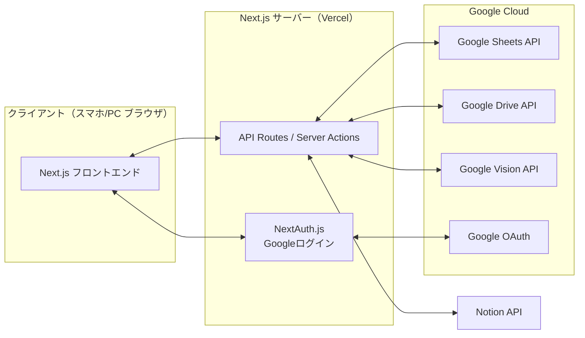
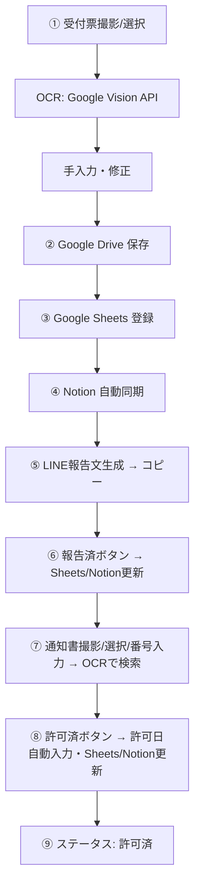

# 外国人入管申請管理システム — システム設計書 (Stage 1)

最終更新: 2026-07-06

## 1. 目的

外国人の入管申請業務をスマートフォンだけで完結させ、Google スプレッドシート・Google Drive・Notion を連携した申請管理システムを構築する。業務入力の自動化と、社内全員がリアルタイムで進捗を確認できる仕組みを実現する。

## 2. 全体アーキテクチャ



Next.js の App Router に フロントエンドと API を統合し、別立ての Node.js サーバーは持たない。理由: デプロイ・保守対象を1系統に絞ることで、社内運用の長期保守性を優先する。Sheets/Drive はサービスアカウント経由でサーバーサイドからのみアクセスし、クライアントに認証情報を渡さない。

## 3. データフロー（業務プロセス全体）



## 4. データモデル

### 4.1 Google Sheets（正データベース）

1シート1行 = 1申請。列構成:

| 列 | 項目 | 型 / 備考 |
|---|---|---|
| A | ID | UUID。重複チェックと Notion 同期キーに使用 |
| B | 氏名 | 文字列 |
| C | 申請日 | 日付（YYYY-MM-DD） |
| D | 申請番号 | 文字列。重複チェック対象 |
| E | 申請内容 | 固定3択（在留資格の変更許可／在留期間の更新許可／在留認定許可申請） |
| F | 受付票画像URL | Google Drive 共有リンク |
| G | 通知書画像URL | Google Drive 共有リンク |
| H | 在留カード画像URL | Google Drive 共有リンク（複数画像は 4.2 参照） |
| I | 許可日 | 日付。⑧の操作で自動入力 |
| J | LINE報告済 | boolean |
| K | Notion同期済 | boolean |
| L | 許可済 | boolean |
| M | ステータス | enum: 申請前 / 申請済 / LINE報告済 / 通知書到着 / 許可済 |
| N | 担当者 | 文字列。ログインユーザーのメールアドレスから自動設定 |
| O | 登録日時 | timestamp（自動） |
| P | 更新日時 | timestamp（更新の都度自動更新） |
| Q | Notion Page ID | Notion 側ページとの紐付けキー |

先頭行をヘッダー行とし、シート名は `申請管理台帳` とする。

### 4.2 画像管理（Google Drive）

- 申請ごとにフォルダを自動作成: `申請管理/{申請番号}_{氏名}/`
- ファイル名規則: `{種別}_{申請日}_{氏名}_{申請番号}.jpg`
  - 種別: 受付票 / 通知書 / 在留カード
  - 例: `受付票_2026-07-06_グエン・ヴァン・A_123456.jpg`
- Sheets の F/G/H 列に各種別の Drive 共有リンクを保持する。将来的に1種別につき複数枚が必要になった場合は、Drive フォルダ内一覧へのリンクに切り替える拡張余地を残す。

### 4.3 Notion Database

Sheets と同一のプロパティ構成をミラーリングする。同期は **Sheets → Notion の一方向**とし、Notion側を直接編集しても Sheets には反映されない設計にする（データ競合防止・保守性のため source of truth を1つに固定）。Sheets の Q列（Notion Page ID）で対応するページを特定し、UPSERT する。

## 5. ステータス状態遷移

```
申請前 → 申請済 → LINE報告済 → 通知書到着 → 許可済
```

一方向のみの遷移とし、逆戻りは想定しない（誤操作時は担当者が個別修正）。UI 上は色分け表示する（Stage 2 の画面デザインで配色を確定）。

## 6. 重複チェック

- **申請番号が既存行と一致**: 登録をブロックし、警告ダイアログを表示（上書きは個別に明示操作が必要）
- **氏名＋申請日が一致**（申請番号は異なる）: 確認メッセージを表示するが登録は継続可能

## 7. 認証・セキュリティ設計

- ログイン: NextAuth.js (Auth.js) + Google Provider。社内ドメイン／許可メールアドレスのホワイトリストでアクセス制御し、対象外アカウントは弾く
- Google Sheets / Drive / Vision へのアクセスはすべて **サービスアカウント**経由（サーバーサイドのみ）。ユーザーの Google OAuth トークンをそのまま Sheets 操作に使わないことで権限を分離する
- Notion Integration Token・Google API 認証情報はすべてサーバーサイド環境変数として保持し、クライアントバンドルに一切含めない
- API Routes 側で入力バリデーション（画像サイズ上限・許可 MIME タイプ・文字列長）を実装
- 環境変数は `.env.local`（ローカル）／ Vercel の Environment Variables（本番）で管理し、リポジトリにコミットしない

## 8. OCR 設計（Google Vision API）

- `POST /api/ocr`: アップロードされた画像を Vision API の `DOCUMENT_TEXT_DETECTION` に渡し、生テキストを取得
- 構造化パーサー（`lib/ocr/parseReceipt.ts` 想定）で、ラベル近傍マッチング＋正規表現により氏名・申請日・申請番号・申請内容を抽出
- 信頼度が低い、または抽出できなかった項目は空欄のまま UI に渡し、手入力・修正を必須とする
- 通知書検索（⑦）でも同エンドポイントを再利用し、抽出した申請番号で Sheets を検索する

## 9. 通知機能（LINE Notify 終了への対応）

LINE Notify は 2025年3月末にサービス終了済みのため、自動 LINE 通知は行わない。代わりに **アプリ内通知**として実装する:

- ダッシュボードにバッジ表示: 未報告件数 / 通知書未登録件数 / 許可未処理件数
- 一覧画面で該当行を警告色でハイライト

⑤の LINE 報告文は引き続き「文章生成＋コピー ボタン」を提供し、実際の送信は担当者が LINE アプリで手動で行う（要件通り、API 送信は行わない）。

将来 LINE 公式アカウント（Messaging API）による自動送信に切り替える場合は、通知ロジックを `lib/notification/` に集約しておき、差し替えポイントとして扱う。

## 10. 技術スタック・プロジェクト構成

- フロントエンド/バックエンド: Next.js 14+ (App Router, TypeScript)
- ホスティング: Vercel
- スタイリング: Tailwind CSS（ダークモード対応・iPhone操作性重視のユーティリティベース）
- データ取得: Server Components 中心、クライアント側の再検証には SWR を使用
- ディレクトリ構成:

```
/app                  ルーティング（App Router）
/components           UIコンポーネント
/lib/google           Sheets / Drive / Vision クライアントラッパー
/lib/notion           Notion API ラッパー
/lib/ocr              OCR パーサー
/lib/status           ステータス状態遷移ロジック
/lib/notification      アプリ内通知ロジック（将来のLINE連携差し替えポイント）
/types                共有型定義
/docs                 設計ドキュメント
```

## 11. 開発ステップ（再掲）

1. システム全体の設計 ← 本ドキュメント（Stage 1）
2. 画面デザイン作成
3. Google ログイン
4. Google スプレッドシート連携
5. Google Drive 画像保存
6. OCR 実装
7. Notion 連携
8. LINE 報告文作成
9. 通知書検索
10. ステータス管理
11. ダッシュボード
12. 最終テスト

各段階完了時に動作確認を行い、合意を得てから次段階へ進む。
