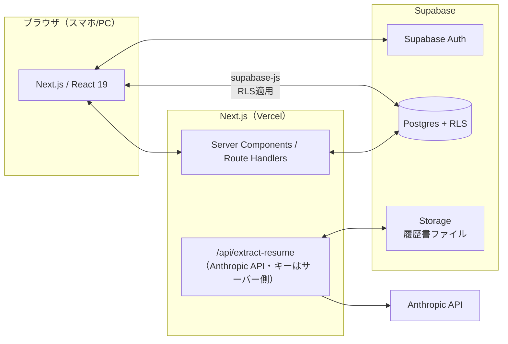

# 特定技能1号 職歴・通算期間管理ツール — React＋Supabase リファクタリング計画

最終更新: 2026-07-12

対象: 単一HTMLファイル「特定技能1号 職歴・通算期間管理（SSW TYPE-1 WORK HISTORY & PERIOD TRACKER）」を、本リポジトリ（Next.js 16 / React 19 / TypeScript / Tailwind CSS 4）＋ Supabase 構成へ移植・再設計する。

---

## 1. 現行HTMLの解析結果

### 1.1 機能一覧

| # | 機能 | 現行実装 |
|---|---|---|
| 1 | 外国人（労働者）の登録・編集・削除 | `<dialog>` ＋ グローバル関数によるCRUD |
| 2 | 職歴の登録・編集・削除 | 労働者にネストした `history[]` 配列 |
| 3 | 特定技能1号の通算期間計算 | `calcWorker()` — 1号の行だけ日数合算、5年上限、残日数、満了予定日 |
| 4 | 60か月ゲージ・サマリーカード | `render()` 内で innerHTML 生成 |
| 5 | 検索・ソート | 氏名/フリガナ/国籍/勤務先の部分一致、残り期間順など4種 |
| 6 | JSON エクスポート／インポート | Blob ダウンロード＋ FileReader（追加/置換の選択あり） |
| 7 | CSV エクスポート | BOM付きCSV、Notionインポート想定 |
| 8 | 履歴書からのAI自動入力 | ブラウザから `api.anthropic.com/v1/messages` を直接 fetch（Claude Artifact 環境専用。PDF/画像→base64、画像は canvas で2000pxに縮小） |
| 9 | 読み取り結果の確認ダイアログ | 抽出JSONをレビューして登録 |
| 10 | 履歴書・記録票の発行 | HTMLシート生成 → `window.print()`（PDF）／ html2canvas（PNG） |
| 11 | 申請用職歴テキストのコピー | `navigator.clipboard` |
| 12 | 自動保存 | 3層フォールバック: `window.storage`（Claude内）→ `localStorage` → メモリのみ |
| 13 | 旧データマイグレーション | `periods` → `history` への変換（`migrate()`） |

### 1.2 データモデル（現行）

```ts
Worker {
  id: string            // Date.now + random の簡易ID
  name: string          // 英字氏名（必須）
  kana: string
  nationality: string
  birth: string         // YYYY-MM-DD
  residenceCard: string // 在留カード番号
  field: string         // 分野・職種
  note: string
  history: HistoryEntry[]
}

HistoryEntry {
  id: string
  visa: "本国での職歴" | "技能実習" | "特定技能1号" | "特定技能2号" | "留学" | "その他"
  start: string         // YYYY-MM-DD（必須）
  end: string | null    // null = 継続中
  org: string
  role: string
  note: string
}
```

### 1.3 コアビジネスロジック（`calcWorker`）

移植時に**挙動を1バイトも変えてはいけない**中心ロジック。仕様として明文化する:

- 通算対象は `visa === "特定技能1号"` の行のみ。技能実習・本国職歴等は記録のみ
- 期間日数 = `(end || 今日) - start + 1`（両端含む）
- 上限日数 = 最初の1号開始日から暦上の5年後までの実日数（初回登録前は `5 × 365.25` の丸め）
- 残日数 = `max(上限 − 通算, 0)`。満了予定日 = 今日 + 残日数 − 1（継続中の場合のみ）
- 年月日換算は 1か月 = 30.4375日 の近似。ゲージは 60か月上限
- ステータス判定: 1号期間未登録 / 5年到達（残0）/ 1号在留中（end なし or 未来）/ 中断中

### 1.4 現行実装の課題（リファクタリング動機）

1. **単一ファイル・密結合**: 描画/計算/永続化/入出力が1つの `<script>` に混在（約650行）
2. **innerHTML ＋手動エスケープ**: `esc()` 頼みで XSS リスクが構造的に残る。React の JSX で解消
3. **グローバル関数 onclick**: `window.editHist` 等の露出。コンポーネント化で解消
4. **永続化がブラウザ依存**: localStorage のみ＝端末を変えるとデータが見えない、複数人で共有不可、バックアップは手動JSON。→ Supabase で解消（本移植の最大の価値）
5. **AIキーの扱い**: ブラウザから Anthropic API を直接叩く構造は Claude Artifact 環境限定。通常デプロイでは**サーバーサイドに API キーを置く**必要がある
6. **認証なし**: 在留カード番号等の個人情報を扱うのに誰でも閲覧可能。→ Supabase Auth ＋ RLS で解消
7. **テスト不能**: 期間計算という法令に関わるロジックにユニットテストがない

---

## 2. 目標アーキテクチャ

### 2.1 方針: 既存 Next.js アプリへ機能統合（推奨）

本リポジトリは既に Next.js 16 / React 19 / TS / Tailwind 4 / lucide-react が整備済み（Stage 2 完了）。別アプリを立てず、**ルートグループとして統合**する。

- 入管申請管理（既存 `/applications`）と職歴管理（新設 `/workers`）は利用者・運用が同一（同じ会社の外国人材管理業務）
- 認証・デザインシステム（Card/Button/StatusBadge/AppHeader/BottomNav/ダークモード）を共有できる
- デプロイ・保守対象を1系統に保つ（`docs/00_system_design.md` の方針と一致）



### 2.2 認証に関する判断

既存設計（Stage 1）は NextAuth ＋ Google ログイン予定だが未実装。本計画では **Supabase Auth（Google プロバイダ）に一本化することを推奨**する:

- DB（RLS）と認証が同一基盤になり、行レベルのアクセス制御が宣言的に書ける
- NextAuth のセッションと Supabase RLS を橋渡しする複雑さ（JWT の受け渡し）を回避
- 許可メールアドレスのホワイトリストは Supabase の `auth.users` トリガー＋ `allowed_emails` テーブル、または Auth Hook で実現

※ 既存の入管申請管理側（Sheets/Drive 連携）の設計に影響するため、着手前に合意を取る。合意が取れない場合、本機能のみ Supabase Auth で独立させる代替案も可能。

### 2.3 データアクセス方針

- **読み取り**: Server Components で初期データ取得（`@supabase/ssr` の server client）→ 一覧の検索/ソート/開閉はクライアント状態
- **書き込み**: クライアントから supabase-js で直接（RLS が防壁）。楽観的更新＋失敗時ロールバック
- **通算計算はDBに持ち込まない**: `calcWorker` 相当は純粋関数 `lib/ssw/calc.ts` としてクライアント/サーバー共用。日々変わる「今日」に依存する計算のため、DB のビューや生成列にせず表示時に計算する（現行と同じ思想）
- 一覧のソート「残り期間順」もクライアント計算で行う（人数規模は社内利用の数十〜数百名想定。DB側集計が必要になったら RPC 化する拡張余地を残す）

---

## 3. Supabase スキーマ設計

### 3.1 テーブル

```sql
-- 在留資格区分
create type visa_type as enum (
  '本国での職歴', '技能実習', '特定技能1号', '特定技能2号', '留学', 'その他'
);

create table workers (
  id              uuid primary key default gen_random_uuid(),
  name            text not null,              -- 英字氏名
  kana            text not null default '',
  nationality     text not null default '',
  birth           date,
  residence_card  text not null default '',   -- 在留カード番号
  field           text not null default '',   -- 分野・職種
  note            text not null default '',
  legacy_id       text,                       -- 旧HTML版のid（JSON移行の重複防止用）
  created_by      uuid not null references auth.users(id) default auth.uid(),
  created_at      timestamptz not null default now(),
  updated_at      timestamptz not null default now()
);

create table work_histories (
  id          uuid primary key default gen_random_uuid(),
  worker_id   uuid not null references workers(id) on delete cascade,
  visa        visa_type not null,
  start_date  date not null,
  end_date    date,                            -- null = 継続中
  org         text not null default '',
  role        text not null default '',
  note        text not null default '',
  created_at  timestamptz not null default now(),
  updated_at  timestamptz not null default now(),
  constraint valid_period check (end_date is null or end_date >= start_date)
);

create index on work_histories (worker_id, start_date);
```

補足:

- 現行の「終了日が開始日より前」のフォームバリデーションを DB 制約（`valid_period`）でも担保
- `updated_at` は `moddatetime` 拡張のトリガーで自動更新
- 履歴書ファイルを残す場合は Storage バケット `resumes/{worker_id}/…` ＋ `resume_files` テーブル（Phase 5 で任意対応）

### 3.2 RLS ポリシー

社内ツールとして「ログイン済み許可ユーザーは全件読み書き可」をベースにする（現行は個人単位のデータ分離がなく、CSV で全員分を扱う運用のため）:

```sql
alter table workers enable row level security;
alter table work_histories enable row level security;

-- allowed_emails に登録されたユーザーのみ全操作可
create policy "staff full access" on workers
  for all using (is_staff(auth.uid())) with check (is_staff(auth.uid()));
-- work_histories も同様
```

`is_staff()` は `allowed_emails` テーブルを引く `security definer` 関数。将来「支援機関ごとにデータを分ける」要件が出たら `org_id` 列＋ポリシー追加で対応（マルチテナント化の拡張ポイント）。

### 3.3 マイグレーション管理

`supabase/migrations/*.sql` をリポジトリにコミットし、Supabase CLI（`supabase db push`）で適用。スキーマから `src/types/supabase.ts` を `supabase gen types typescript` で自動生成する。

---

## 4. フロントエンド設計

### 4.1 ルーティング・ディレクトリ構成

```
src/
  app/(app)/workers/
    page.tsx                 # 一覧（サマリー・検索・ソート）… RSCで初期取得
    WorkersExplorer.tsx      # クライアント側の検索/ソート/開閉/CRUD起点
    [id]/…                   #（任意）詳細を別ページ化する場合
  components/workers/
    WorkerCard.tsx           # 開閉カード（現行 .worker 相当）
    SswGauge.tsx             # 60か月ゲージ
    SummaryCards.tsx         # 登録人数/在留中/残り1年以内/5年到達
    HistoryTable.tsx         # 職歴テーブル
    WorkerFormDialog.tsx     # 登録/編集モーダル
    HistoryFormDialog.tsx    # 職歴 追加/編集モーダル
    ResumeExtractDialog.tsx  # AI読み取り→レビュー→登録
    WorkerSheet.tsx          # 履歴書・記録票（印刷/PNG）
  lib/ssw/
    calc.ts                  # calcWorker/entryDays/toYMD/addYears… 純粋関数
    calc.test.ts             # ユニットテスト
    csv.ts                   # CSV生成
    import.ts                # 旧JSON→Supabase 変換・投入
    immigration-text.ts      # 申請用職歴テキスト生成
  lib/supabase/
    client.ts / server.ts    # @supabase/ssr ラッパー
  app/api/extract-resume/route.ts  # Anthropic API プロキシ
```

既存の `ui/Card` `ui/Button` `StatusBadge` `AppHeader` `BottomNav` を再利用し、BottomNav に「職歴管理」タブを追加する。

### 4.2 状態管理

- サーバー状態: 初期は RSC ＋ `router.refresh()`／必要に応じ SWR（既存設計の方針に合わせる）。CRUD 後は楽観的更新
- UI状態（検索語・ソート・カード開閉 `openSet`・ダイアログ開閉）: コンポーネントローカル state。グローバルストア不要
- 現行の「300ms デバウンス自動保存」は不要になる（操作単位で即 Supabase へ書き込み、保存状態インジケータは mutation の pending/error 表示に置換）

### 4.3 現行機能の置き換え対応表

| 現行 | 移植後 |
|---|---|
| `window.storage` / localStorage | Supabase Postgres（自動・全端末共有） |
| JSON保存/読込 | **移行ツールとして残す**: 旧JSONインポート（§6）＋ バックアップ用エクスポートは任意で維持 |
| CSV出力 | `lib/ssw/csv.ts` に移植（列構成・BOM・引用符エスケープは現行踏襲） |
| AI抽出（ブラウザ→Anthropic直） | `POST /api/extract-resume`（サーバーで `ANTHROPIC_API_KEY` 使用、モデル/プロンプト/画像縮小ロジックは現行踏襲。クライアント側の canvas 縮小は維持して転送量を抑える） |
| `<dialog>` ＋ showModal | Radix Dialog もしくは既存UIに合わせた自作モーダル（既存アプリの流儀に合わせる） |
| html2canvas CDN | npm 依存に変更（`html2canvas` or `html-to-image`）。印刷は `@media print` CSS を移植 |
| `confirm()`/`alert()` | 確認ダイアログコンポーネント＋トースト |
| トースト | 既存アプリのトースト（なければ小さな共通コンポーネント新設） |

---

## 5. 実装フェーズ

各フェーズ完了ごとに動作確認 → コミット。既存の Stage 運用と同じ進め方。

| Phase | 内容 | 完了条件 |
|---|---|---|
| **P1: ドメインロジック移植** | `lib/ssw/calc.ts` に純粋関数として移植＋型定義。**ユニットテスト**（両端含む日数、5年上限のうるう年跨ぎ、継続中、複数期間の合算、残0、30.4375換算の境界） | 現行HTMLと同一入力→同一出力をテストで担保 |
| **P2: UI コンポーネント化** | モックデータで `/workers` 一覧・カード・ゲージ・ダイアログ・検索/ソートを実装（既存デザインシステムに統一、ダークモード対応） | 現行HTMLの全画面操作がモックで再現 |
| **P3: Supabase 基盤** | プロジェクト作成、マイグレーション（§3）、`@supabase/ssr` 導入、型生成、Auth（Google＋ホワイトリスト）、RLS | ログイン必須で CRUD が DB に永続化 |
| **P4: データ移行** | 旧HTML版の JSON エクスポートを読み込んで Supabase に投入するインポート画面（`legacy_id` で重複防止、追加/置換は現行同様の選択式） | 実データのJSONが取り込める |
| **P5: AI履歴書抽出** | `/api/extract-resume` Route Handler、レビューダイアログ、（任意）原本を Supabase Storage へ保存 | PDF/画像から抽出→確認→登録が動く |
| **P6: 帳票・出力** | 履歴書・記録票シート（印刷CSS/PNG）、CSV出力、申請用テキストコピー | 現行と同等の出力物 |
| **P7: 仕上げ** | 削除確認・エラー処理・ローディング状態、スマホ実機確認、Vercel＋Supabase 本番環境、環境変数設定 | 本番URLで全機能動作 |

規模感: P1〜P2 が最も速く進む（依存なし）。P3 は Supabase プロジェクトの作成権限が必要（下記 §7）。

---

## 6. データ移行手順（利用者向け）

1. 旧HTMLツールを開き「JSON保存」で全データをエクスポート
2. 新アプリの「旧データ取込」画面で JSON を選択
3. 変換規則: `workers[].history[]` → `workers` / `work_histories` 2テーブルへ分解。旧 `id` は `legacy_id` に保存し再取込時は上書き（重複行を作らない）。旧 `periods` 形式（v1）も現行 `migrate()` と同じ規則で受け付ける
4. 取込結果を一覧で確認（人数・職歴件数のサマリー表示）

---

## 7. 必要な準備（ユーザー側アクション）

| 項目 | 用途 | 必要時期 |
|---|---|---|
| Supabase プロジェクト作成（無料枠可） | DB/Auth/Storage | P3 まで |
| `NEXT_PUBLIC_SUPABASE_URL` / `NEXT_PUBLIC_SUPABASE_ANON_KEY` | クライアント接続 | P3 |
| `SUPABASE_SERVICE_ROLE_KEY` | サーバー側管理操作（移行・型生成） | P3〜P4 |
| Google OAuth クライアント（Supabase Auth に設定） | ログイン | P3 |
| `ANTHROPIC_API_KEY` | AI履歴書抽出 | P5 |
| 許可メールアドレス一覧 | アクセス制御 | P3 |

---

## 8. リスクと対応

| リスク | 対応 |
|---|---|
| 期間計算の移植ミス（法令関連の数値） | P1 で現行ロジックの出力とスナップショット比較するテストを先に書く。「通算は目安・正式判断は入管庁」の注記も必ず移植 |
| 既存アプリの認証方針（NextAuth予定）との衝突 | §2.2 の通り Supabase Auth への一本化を先に合意。決まるまで P3 に着手しない |
| AI抽出のコスト/悪用（公開エンドポイント化） | Route Handler で認証必須＋ファイルサイズ/MIME検証＋レート制限 |
| 個人情報（在留カード番号等）の取り扱い | RLS 必須・HTTPS・Supabase のリージョン選択（東京）を確認。CSV/JSON エクスポートは操作ログを残す運用も検討 |
| html2canvas の日本語フォント差異 | PNG出力は補助機能とし、印刷（PDF）を正とする現行方針を維持 |
