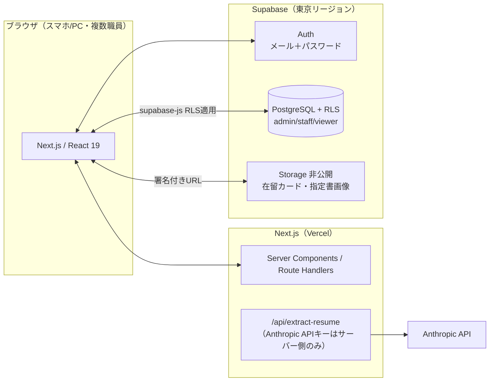

# 特定技能 職歴・支援管理システム — React＋Supabase 移行計画書

最終更新: 2026-07-12（v2: 登録支援機関の業務システム化要件を反映）

対象: 単一HTMLファイル「特定技能1号 職歴・通算期間管理」を、本リポジトリ（Next.js 16 / React 19 / TypeScript / Tailwind CSS 4）＋ Supabase（PostgreSQL / Auth / Storage）構成の**複数職員向け業務システム**へ移行・拡張する。

DBの詳細設計は `docs/03_database_design.md` を参照。

---

## 1. 現行HTMLの分析（依頼①）

### 1.1 実装済み機能

| # | 機能 | 現行実装 | 移行後 |
|---|---|---|---|
| 1 | 外国人基本情報の登録・編集・削除 | `<dialog>`＋グローバル関数、innerHTML描画 | React コンポーネント＋Supabase CRUD |
| 2 | 職歴の登録・編集・削除 | worker にネストした `history[]` | `work_histories` テーブル |
| 3 | 特定技能1号 通算期間計算 | `calcWorker()`（1号行のみ日数合算・5年上限・残日数・満了予定日・60か月ゲージ） | 純粋関数 `lib/ssw/calc.ts`＋ユニットテスト。**通算対象に「特定活動（1号移行準備）」を追加** |
| 4 | 検索・ソート・サマリー | クライアント処理 | 同方式を維持＋状態/所属機関フィルターを追加 |
| 5 | 履歴書・記録票の発行 | HTML生成→`window.print()`／html2canvas(PNG) | `@media print` CSS 移植、html2canvas は npm 依存化 |
| 6 | CSV出力 | BOM付きCSV | `lib/ssw/csv.ts` に移植（列構成踏襲＋新項目追加） |
| 7 | JSONバックアップ/読込 | Blob / FileReader | **移行ツール化**（旧データ取込画面）。以後のバックアップはDBが担う |
| 8 | AIによる履歴書読込 | ブラウザから Anthropic API を直接 fetch（Claude Artifact 環境限定） | `POST /api/extract-resume`（APIキーはサーバー側環境変数） |
| 9 | 自動保存 | `window.storage` → localStorage → メモリの3層フォールバック | Supabase に即時書き込み（全端末・全職員で共有） |

### 1.2 リファクタリングが必要な理由

1. **複数人利用ができない**: localStorage は端末・ブラウザ単位。登録支援機関の業務システムには共有DBが必須（本移行の最大の目的）
2. **認証・権限がない**: 在留カード番号等の個人情報を扱うのに誰でも操作可能。管理者/一般職員/閲覧のみの権限管理が必要
3. **構造的な保守性**: 描画・計算・保存・入出力が1つの `<script>`（約650行）に密結合。innerHTML＋手動エスケープはXSSリスクが残る
4. **AI読み取りが環境依存**: ブラウザからの直接API呼び出しは通常のWebデプロイでは動かない（APIキーをサーバーに置く必要）
5. **法令に関わる計算にテストがない**: 通算5年計算はユニットテストで挙動を固定すべき

### 1.3 新規追加機能（今回の拡張要件）

| 要件 | 概要 | DB対応（docs/03） |
|---|---|---|
| ① 在留資格区分追加 | 特定活動（1号移行準備）=**通算対象**／特定活動（2号移行準備） | `visa_type` enum に2値追加、計算関数の対象セット変更 |
| ② 求職管理簿 | 応募先・応募日・面接日・結果日・採用/不採用/辞退 | `job_applications` テーブル |
| ③ 採用管理 | 採用日・採用先・職種・業種、現在所属機関を自動更新 | `employments` テーブル＋トリガー |
| ④ 外国人情報追加 | 支援対象/対象外、支援中/求職活動中/帰国/退職、健康状態、家族構成、現在所属機関、在留資格・許可日・期限日 | `workers` 列追加＋`organizations` マスタ |
| ⑤ フィルター | 状態別・支援対象外・現在所属機関別 | `workers.status / support / current_organization_id`＋インデックス |
| ⑥ 画像管理 | 在留カード表/裏・指定書 | `worker_files`＋Storage 非公開バケット |
| ⑦ ログイン・権限 | メール＋パスワード、admin/staff/viewer | Supabase Auth＋`profiles`＋RLS |

## 2. 目標アーキテクチャ



- **認証**: Supabase Auth のメール＋パスワード（要件⑦）。職員はadminが招待で追加し、`profiles.role` で権限を付与。閲覧のみユーザーはRLSでSQLレベルの書き込み不可
- **データアクセス**: 読み取りは Server Components で初期取得、書き込みはクライアントから supabase-js（RLSが防壁）。通算計算・フィルター・ソートはクライアント側（数百名規模想定。将来必要ならRPC化）
- **既存の入管申請管理（`/applications`・Google Sheets構想）とは共存**: 本システムは Supabase を正とする。将来統合する場合は申請テーブルを同一DBに追加する（docs/03 §10）

## 3. フォルダ構成（依頼④）

既存リポジトリの構成（`(app)` ルートグループ、`components/ui`、`lib`）を踏襲して拡張する。

```
src/
├ app/
│ ├ (app)/
│ │ ├ applications/…                # 既存: 入管申請管理（現状維持）
│ │ ├ workers/                      # ★外国人管理
│ │ │ ├ page.tsx                    #   一覧（サマリー・検索・フィルター・ソート）
│ │ │ ├ WorkersExplorer.tsx         #   "use client" 一覧ロジック
│ │ │ ├ new/page.tsx                #   新規登録（AI読み取り含む）
│ │ │ ├ import/page.tsx             #   旧HTML版JSONデータ取込
│ │ │ └ [id]/                       #   詳細（情報量が増えたため詳細ページ化）
│ │ │   ├ page.tsx                  #     基本情報＋通算ゲージ＋タブ切替
│ │ │   ├ WorkerDetail.tsx
│ │ │   └ sheet/page.tsx            #     履歴書・記録票（印刷ビュー）
│ │ ├ jobs/page.tsx                 # ★求職管理簿（全員横断ビュー・選考中一覧）
│ │ └ admin/                        # ★admin専用
│ │   ├ users/page.tsx              #   職員・権限管理
│ │   └ organizations/page.tsx      #   会社・機関マスタ管理
│ ├ api/
│ │ └ extract-resume/route.ts       # ★AI履歴書読み取り（認証必須）
│ ├ login/page.tsx                  # メール＋パスワードログイン
│ └ layout.tsx
├ components/
│ ├ ui/…                            # 既存: Card / Button / StatusBadge ＋ ConfirmDialog / Toast を共通追加
│ └ workers/
│   ├ SummaryCards.tsx              # 登録人数/在留中/残り1年以内/5年到達
│   ├ WorkerFilters.tsx             # ★状態・支援対象・所属機関フィルター
│   ├ SswGauge.tsx                  # 60か月ゲージ
│   ├ HistoryTable.tsx / HistoryFormDialog.tsx        # 職歴
│   ├ JobApplicationTable.tsx / JobApplicationDialog.tsx  # ★求職管理簿
│   ├ EmploymentDialog.tsx          # ★採用記録（採用→所属自動更新の起点）
│   ├ WorkerFormDialog.tsx          # 基本情報（拡張項目含む）
│   ├ WorkerFilesPanel.tsx          # ★在留カード表/裏・指定書のアップロード/表示
│   ├ ResumeExtractDialog.tsx       # AI読取→レビュー→登録
│   └ WorkerSheet.tsx               # 履歴書・記録票（印刷CSS/PNG）
├ lib/
│ ├ ssw/
│ │ ├ calc.ts                       # ★通算計算の純粋関数（COUNTED_VISAS 定数を含む）
│ │ ├ calc.test.ts                  # ★ユニットテスト（最重要）
│ │ ├ csv.ts / import.ts / immigration-text.ts
│ ├ supabase/
│ │ ├ client.ts / server.ts         # @supabase/ssr ラッパー
│ │ ├ queries/                      # テーブル別のデータアクセス関数
│ │ │ ├ workers.ts / histories.ts / jobs.ts / employments.ts
│ │ │ ├ organizations.ts / files.ts / profiles.ts
│ │ └ storage.ts                    # 署名付きURL取得・アップロード
│ └ auth/guard.ts                   # ロール判定・ページガード（viewer は編集UI非表示）
├ types/
│ ├ supabase.ts                     # CLIで自動生成
│ └ ssw.ts                          # 計算入力用のアプリ内型
├ middleware.ts                     # 未ログイン → /login リダイレクト
supabase/
├ migrations/0001〜0006_*.sql       # docs/03 §7 参照
└ config.toml
```

設計原則: **計算（lib/ssw）・データアクセス（lib/supabase/queries）・表示（components）を分離**し、`calc.ts` はDOMにもSupabaseにも依存しない純粋関数として単体テスト可能にする。権限は RLS（サーバー側強制）が本体で、`lib/auth/guard.ts` は viewer に編集ボタンを見せないための表示制御。

## 4. 段階的移行手順（依頼⑤）

各フェーズが独立して動作確認できる順序。**旧HTMLツールは Phase 5 のデータ移行完了まで並行利用できる。**

### Phase 1: 計算ロジック移植＋テスト（依存なし・最初に着手）
1. `types/ssw.ts`・`lib/ssw/calc.ts` へ現行 `calcWorker` 群を純粋関数として移植
2. **仕様変更**: 通算対象を `{特定技能1号, 特定活動（特定技能1号移行準備）}` のセットに変更
3. ユニットテスト: 両端含む日数計算／うるう年跨ぎの5年上限／継続中／複数期間・**複数区分の合算**／残0／30.4375換算境界
- ✅ 完了条件: 旧HTMLと同一入力→同一出力（＋特定活動合算の新ケース）がテストで担保される

### Phase 2: Supabase 基盤・認証・権限（要: Supabaseプロジェクト）
1. Supabase プロジェクト作成（東京リージョン）→ マイグレーション 0001〜0003, 0006 適用 → TS型生成
2. メール＋パスワードログイン（`/login`）、middleware で未ログインリダイレクト
3. `profiles`（admin/staff/viewer）と RLS、`/admin/users` で職員・権限管理
- ✅ 完了条件: 招待した職員がログインでき、viewer アカウントでは書き込みがDBレベルで拒否される

### Phase 3: 外国人・職歴のコア機能（現行機能の再現）
1. `/workers` 一覧（サマリー・検索・ソート・60か月ゲージ）と `[id]` 詳細ページ
2. 基本情報（拡張項目④含む）・職歴のCRUD、`organizations` マスタと `/admin/organizations`
3. フィルター⑤（状態・支援対象・所属機関別）
- ✅ 完了条件: 旧HTMLの登録〜通算表示の全操作が複数端末・複数職員で動く

### Phase 4: 求職管理簿・採用管理（新機能②③）
1. worker 詳細に求職管理簿タブ（応募・面接・結果の記録）、`/jobs` で選考中の横断一覧
2. 結果「採用」→ 採用記録ダイアログ → `employments` 登録 → 現在所属機関の自動更新（トリガー）
- ✅ 完了条件: 応募→採用→所属機関反映の一連が動き、機関別フィルターに反映される

### Phase 5: 旧データ移行（旧ツールからの引っ越し）
1. `/workers/import`: 旧HTMLの「JSON保存」ファイルを選択 → `legacy_id` でUPSERT（v1 `periods` 形式も受付）
2. 取込サマリー表示（人数・職歴件数・スキップ件数）、通算値が旧HTML表示と一致することを確認
- ✅ 完了条件: 実データ移行完了。**この時点で旧HTMLツールを卒業**

### Phase 6: 画像管理（新機能⑥）
1. Storage 非公開バケット＋マイグレーション 0005、`WorkerFilesPanel`（在留カード表/裏・指定書のアップロード・署名付きURL表示・差し替え）
- ✅ 完了条件: 各画像の登録・閲覧が権限どおりに動く（viewer は閲覧のみ）

### Phase 7: AI履歴書読み込み
1. `POST /api/extract-resume`: 認証チェック→サイズ/MIME検証→Anthropic API（プロンプト・抽出スキーマは現行踏襲、クライアント側の画像縮小も維持）
2. レビューダイアログ→確定登録（任意: 原本を Storage へ保存）
- ✅ 完了条件: PDF/画像から抽出→確認→登録が本番相当環境で動く

### Phase 8: 帳票・出力
1. 履歴書・記録票シート（印刷CSS/PNG）、CSV出力（新項目追加）、申請用職歴テキストコピー
- ✅ 完了条件: 現行同等＋新項目入りの出力物

### Phase 9: 本番化
1. Vercel 環境変数設定・デプロイ、スマホ実機確認、エラー/ローディング総点検、全ロールでの権限テスト
- ✅ 完了条件: 本番URLで全機能・全ロール動作

## 5. 必要な準備（ユーザー側アクション）

| 項目 | 用途 | 必要時期 |
|---|---|---|
| Supabase プロジェクト作成（東京リージョン・無料枠可） | DB/Auth/Storage | Phase 2 |
| `NEXT_PUBLIC_SUPABASE_URL` / `NEXT_PUBLIC_SUPABASE_ANON_KEY` / `SUPABASE_SERVICE_ROLE_KEY` | 接続・管理操作 | Phase 2 |
| 職員のメールアドレス一覧と各人のロール | 招待・権限設定 | Phase 2 |
| `ANTHROPIC_API_KEY` | AI履歴書読み取り | Phase 7 |
| Vercel アカウント | 本番ホスティング | Phase 9 |

## 6. リスクと対応

| リスク | 対応 |
|---|---|
| 通算計算の移植ミス・仕様変更ミス（法令関連） | Phase 1 でテストを先に書く。特定活動（1号移行準備）の算入は新規ルールなので、貴社の運用実例で必ず検算。「通算は目安・正式判断は入管庁」の注記を全画面に維持 |
| 個人情報（在留カード画像・健康状態等）の保護 | RLS必須・Storage非公開・署名付きURL・東京リージョン。viewer ロールで最小権限閲覧 |
| AI抽出エンドポイントの悪用・コスト | 認証必須＋サイズ/MIME検証＋レート制限 |
| 採用時の所属自動更新の齟齬（転職・退職の順序） | トリガーは「最新 hired_on のレコード」を正とし、手動修正も可能にする |
| 移行期間中の二重管理 | Phase 5 完了までは旧ツールを正とし、新システムは検証用。移行日を決めて一括切替 |
