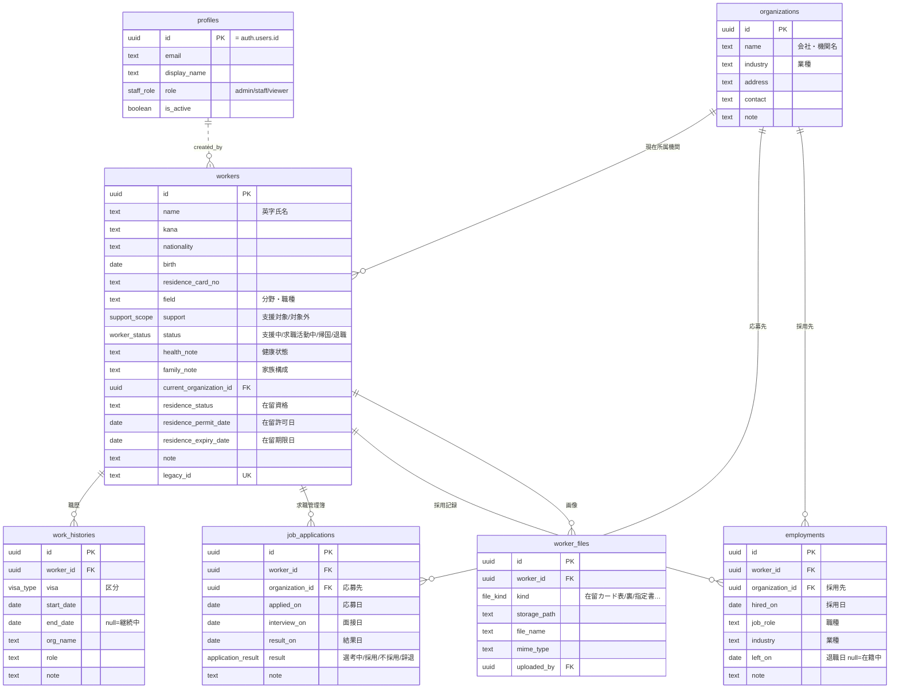

# 特定技能 職歴・支援管理システム — データベース設計書（Supabase / PostgreSQL）

最終更新: 2026-07-12（v2: 登録支援機関の業務システム化要件を反映）

対象: 現行HTMLツールの機能に加え、以下の追加要件を満たすスキーマ設計。

- 在留資格区分の追加（特定活動〔1号移行準備〕＝**通算対象**、特定活動〔2号移行準備〕）
- 求職管理簿（応募先・応募日・面接日・結果日・採用/不採用/辞退）
- 採用管理（採用日・採用先・職種・業種、現在所属機関の自動更新）
- 外国人情報の拡張（支援対象/対象外、支援中/求職活動中/帰国/退職、健康状態、家族構成、現在所属機関、在留資格・許可日・期限日）
- フィルター（状態別・現在所属機関別）
- 画像管理（在留カード表/裏・指定書）
- ログイン（メール＋パスワード）と権限管理（管理者/一般職員/閲覧のみ）

---

## 1. 設計方針

1. **通算計算の結果はDBに保存しない。** 通算日数・残日数・満了予定日は“今日”に依存するため、DBには事実（区分・開始日・終了日）だけを置き、表示時にアプリの純粋関数で計算する。「どの区分が通算対象か」のルール（特定技能1号＋特定活動〔1号移行準備〕）はアプリ側の定数として一元管理する。
2. **会社・機関はマスタテーブル化する。** 応募先・採用先・現在所属機関はすべて `organizations` を参照する。表記ゆれを防ぎ、「現在所属機関別フィルター」を成立させるため。
3. **求職（応募）と採用（雇用）は別テーブルに分ける。** 応募は何社でも並行し不採用・辞退も履歴として残る一方、採用は所属の変化という別の事実。応募の結果が「採用」になったら `employments` に1行作り、トリガーで `workers.current_organization_id` を自動更新する。
4. **権限は3ロール（admin / staff / viewer）を `profiles` テーブルに持ち、全テーブルのRLSで強制する。** 閲覧のみユーザーはSQLレベルで書き込み不可。
5. **画像はSupabase Storage（非公開バケット）＋メタデータテーブル。** 在留カード等の個人情報のため公開URLは使わず、署名付きURLで表示する。
6. **旧HTMLデータの取り込みを前提に `legacy_id` を保持**し、同じバックアップJSONを何度取り込んでも重複しない。

## 2. ER 図



## 3. enum 定義

```sql
-- 在留資格区分（職歴用）。既存6種＋特定活動2種
create type visa_type as enum (
  '本国での職歴', '技能実習',
  '特定技能1号', '特定技能2号',
  '特定活動（特定技能1号移行準備）',   -- ★通算5年のカウント対象
  '特定活動（特定技能2号移行準備）',
  '留学', 'その他'
);

create type support_scope      as enum ('支援対象', '支援対象外');
create type worker_status      as enum ('支援中', '求職活動中', '帰国', '退職');
create type application_result as enum ('選考中', '採用', '不採用', '辞退');
create type file_kind          as enum ('在留カード表', '在留カード裏', '指定書', '履歴書', 'その他');
create type staff_role         as enum ('admin', 'staff', 'viewer');
```

**通算対象ルール**（アプリ側 `lib/ssw/calc.ts` の定数）:

```ts
const COUNTED_VISAS = new Set(['特定技能1号', '特定活動（特定技能1号移行準備）']);
```

※ 移行準備のための特定活動期間は特定技能1号の通算在留期間に算入される、という入管運用に対応。旧HTMLの「1号のみカウント」からの仕様変更点であり、テストで両区分の合算を担保する。

## 4. テーブル定義

### 4.1 `profiles` — 職員（ログインユーザー）

Supabase Auth（メール＋パスワード）の `auth.users` と 1:1。

| 列 | 型 | 制約 / 備考 |
|---|---|---|
| id | uuid | PK, FK → auth.users(id) on delete cascade |
| email | text | not null |
| display_name | text | not null default '' |
| role | staff_role | not null default 'viewer'（**昇格は admin のみ**） |
| is_active | boolean | not null default true（退職職員は false で即失効） |
| created_at / updated_at | timestamptz | 自動 |

職員の追加はサインアップ開放ではなく、**admin が Supabase の招待メール（またはダッシュボード）で発行**する運用。`auth.users` 作成時にトリガーで `profiles` 行を自動生成（role='viewer'）し、admin が昇格させる。

### 4.2 `organizations` — 会社・機関マスタ

| 列 | 型 | 備考 |
|---|---|---|
| id | uuid | PK |
| name | text | not null, unique。会社・受入機関名 |
| industry | text | 業種（採用管理④の集計にも使用） |
| address / contact / note | text | 任意 |
| created_at / updated_at | timestamptz | |

### 4.3 `workers` — 外国人

| 列 | 型 | 制約 / 既定値 | 由来 |
|---|---|---|---|
| id | uuid | PK | |
| name | text | not null（英字氏名） | 現行 |
| kana / nationality / field / note | text | not null default '' | 現行 |
| birth | date | null可 | 現行 |
| residence_card_no | text | not null default '' | 現行（residenceCard） |
| **support** | support_scope | not null default '支援対象' | 追加④ |
| **status** | worker_status | not null default '支援中' | 追加④・フィルター⑤ |
| **health_note** | text | not null default ''（健康状態） | 追加④ |
| **family_note** | text | not null default ''（家族構成） | 追加④ |
| **current_organization_id** | uuid | null可, FK → organizations | 追加④・採用時に自動更新③ |
| **residence_status** | text | not null default ''（現在の在留資格） | 追加④ |
| **residence_permit_date** | date | null可（在留許可日） | 追加④ |
| **residence_expiry_date** | date | null可（在留期限日。期限アラートに使用） | 追加④ |
| legacy_id | text | unique, null可 | 旧JSON移行 |
| created_by | uuid | FK → profiles(id) | |
| created_at / updated_at | timestamptz | 自動 | |

在留資格（residence_status）は自由入力の text とする。職歴の `visa_type` と違い「現在の在留資格」は家族滞在等いくらでも種類があり、enum で縛ると運用が詰まるため。UI では候補リスト（datalist）を出す。

### 4.4 `work_histories` — 職歴・在留歴（現行機能）

| 列 | 型 | 制約 |
|---|---|---|
| id | uuid | PK |
| worker_id | uuid | not null, FK → workers on delete cascade |
| visa | visa_type | not null |
| start_date | date | not null |
| end_date | date | null可（null = 継続中）。CHECK `end_date >= start_date` |
| org_name | text | not null default ''（勤務先。マスタ参照ではなく自由記載 — 本国の会社等マスタ化しない先が大半のため） |
| role / note | text | not null default '' |
| legacy_id | text | 旧JSON移行 |
| created_at / updated_at | timestamptz | |

### 4.5 `job_applications` — 求職管理簿（追加②）

| 列 | 型 | 制約 |
|---|---|---|
| id | uuid | PK |
| worker_id | uuid | not null, FK → workers on delete cascade |
| organization_id | uuid | not null, FK → organizations（応募先会社） |
| applied_on | date | not null（応募日） |
| interview_on | date | null可（面接日） |
| result_on | date | null可（結果日） |
| result | application_result | not null default '選考中' |
| note | text | not null default '' |
| created_at / updated_at | timestamptz | |

CHECK: `result = '選考中' or result_on is not null`（結果が出たら結果日必須）。

### 4.6 `employments` — 採用管理（追加③）

| 列 | 型 | 制約 |
|---|---|---|
| id | uuid | PK |
| worker_id | uuid | not null, FK → workers on delete cascade |
| organization_id | uuid | not null, FK → organizations（採用先） |
| hired_on | date | not null（採用日） |
| job_role | text | not null default ''（職種） |
| industry | text | not null default ''（業種。空なら organizations.industry を表示） |
| left_on | date | null可（退職日。null = 在籍中） |
| note | text | not null default '' |
| created_at / updated_at | timestamptz | |

**自動更新トリガー**: `employments` の insert 時に `workers.current_organization_id = NEW.organization_id`、`workers.status = '支援中'` に更新。`left_on` が設定されたら（update時）、それが最新の在籍レコードであれば `current_organization_id` を null に戻し `status='退職'` にする。UI フローは「求職管理簿で結果を『採用』にする → 採用記録の作成ダイアログが開く」。

### 4.7 `worker_files` — 画像・ファイル管理（追加⑥）

| 列 | 型 | 制約 |
|---|---|---|
| id | uuid | PK |
| worker_id | uuid | not null, FK → workers on delete cascade |
| kind | file_kind | not null（在留カード表/裏・指定書・履歴書・その他） |
| storage_path | text | not null。`worker-files/{worker_id}/{kind}_{uuid}.{ext}` |
| file_name / mime_type | text | not null |
| uploaded_by | uuid | FK → profiles |
| created_at | timestamptz | |

Storage バケット `worker-files` は**非公開**。表示は署名付きURL（有効期限付き）で行い、Storage 側にも下記 §6 と同等の RLS を設定する。在留カード表/裏は kind ごとに最新1枚を代表として表示し、過去分も履歴として残す（差し替え時に削除しない）。

## 5. インデックス

```sql
create index idx_histories_worker   on work_histories (worker_id, start_date);
create index idx_workers_status     on workers (status);            -- フィルター⑤
create index idx_workers_org        on workers (current_organization_id); -- 機関別フィルター⑤
create index idx_workers_expiry     on workers (residence_expiry_date);   -- 期限アラート
create index idx_apps_worker        on job_applications (worker_id, applied_on desc);
create index idx_apps_result        on job_applications (result);
create index idx_employments_worker on employments (worker_id, hired_on desc);
create index idx_files_worker       on worker_files (worker_id, kind);
```

## 6. 権限設計（RLS）

ロール取得関数:

```sql
create function my_role() returns staff_role
language sql stable security definer set search_path = public as $$
  select role from profiles where id = auth.uid() and is_active;
$$;
```

| 操作 | admin | staff（一般職員） | viewer（閲覧のみ） |
|---|---|---|---|
| 全テーブル select | ○ | ○ | ○ |
| workers / work_histories / job_applications / employments / organizations / worker_files の insert・update・delete | ○ | ○ | × |
| profiles の閲覧 | 全員分 | 全員分 | 自分のみ |
| profiles の role 変更・無効化（職員管理） | ○ | × | × |

ポリシー実装パターン（全業務テーブル共通）:

```sql
alter table workers enable row level security;
create policy sel_workers on workers for select
  using (my_role() is not null);
create policy mod_workers on workers for insert
  with check (my_role() in ('admin','staff'));
create policy upd_workers on workers for update
  using (my_role() in ('admin','staff')) with check (my_role() in ('admin','staff'));
create policy del_workers on workers for delete
  using (my_role() in ('admin','staff'));
-- 他テーブルも同一パターン。profiles のみ admin 特権ポリシー
```

Storage（`storage.objects`）にも同じ条件のポリシーを張る: select は全ロール、insert/delete は admin/staff、バケット `worker-files` 限定。

## 7. マイグレーション構成

```
supabase/migrations/
  0001_enums.sql        # §3 の enum
  0002_profiles.sql     # profiles + auth.users トリガー + my_role()
  0003_core.sql         # organizations / workers / work_histories
  0004_recruiting.sql   # job_applications / employments + 所属自動更新トリガー
  0005_files.sql        # worker_files + Storage バケット/ポリシー
  0006_rls.sql          # 全テーブルの RLS ポリシー
```

適用は Supabase CLI（`supabase db push`）。適用後 `supabase gen types typescript > src/types/supabase.ts` で TS 型を自動生成する。enum への値追加は `alter type ... add value` で後方互換に行える。

## 8. 旧データ移行マッピング

| 旧HTML（JSON） | 移行先 |
|---|---|
| `workers[].name/kana/nationality/birth/residenceCard/field/note` | `workers` 同名列（residence_card_no） |
| `workers[].id` | `workers.legacy_id`（UPSERTキー） |
| `workers[].history[]` | `work_histories`（visa は enum 値そのまま） |
| 旧v1 `periods[]` | `work_histories`（visa='特定技能1号' 固定で変換） |
| — （新規列: support/status/健康状態など） | 既定値で投入し、移行後に画面から補完 |

## 9. フィルター⑤への対応

- 「求職活動中／支援中／退職／帰国」 → `workers.status`（インデックス済み）
- 「支援対象外」 → `workers.support`
- 「現在所属機関別」 → `workers.current_organization_id` → organizations 名で表示
- 一覧クエリ: `workers` に `organizations(name)` と `work_histories(*)` をネストして1回で取得し、通算計算・並び替えはクライアント側（数百名規模なら十分。数千名超で必要になれば RPC 化）

## 10. 拡張余地（今は作らない）

| 将来要件 | 対応 |
|---|---|
| 支援記録（定期面談・生活支援ログ） | `support_logs` テーブル追加（worker_id, 日付, 種別, 内容） |
| 在留期限アラートの自動通知 | Supabase Cron + Edge Function でメール送信 |
| 拠点・支店ごとのデータ分離 | `org_unit_id` 列＋RLS条件追加（マルチテナント化） |
| 監査ログ（誰がいつ何を変更したか） | `audit_log` テーブル＋トリガー |
| 既存の入管申請管理との統合 | `applications` テーブルを同一DBに追加し `worker_id` で紐付け |
