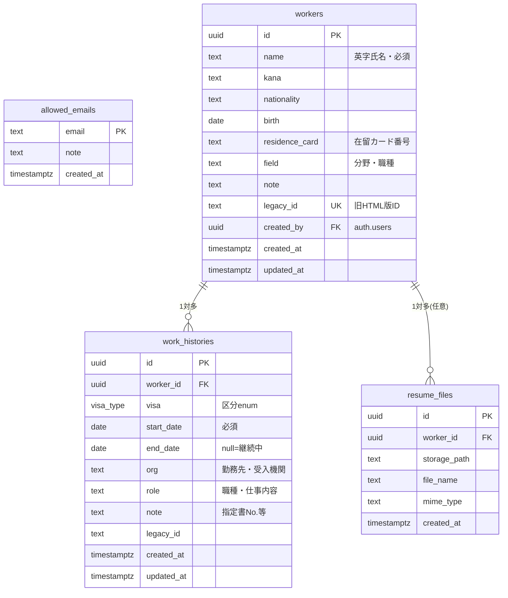

# 特定技能1号 職歴管理 — データベース設計書（Supabase / PostgreSQL）

最終更新: 2026-07-12
対象: `docs/02_ssw_tracker_react_supabase_plan.md` の Phase 3 で適用する DB スキーマの詳細設計。

---

## 1. 設計方針

1. **現行HTMLのデータモデルを正規化する。** 旧ツールは `Worker` の中に `history[]` をネストした JSON 1本だったものを、`workers`（親）と `work_histories`（子）の 1対多 に分解する。
2. **通算5年の計算結果は保存しない。** 「通算日数・残り日数・満了予定日」は“今日”に依存して毎日変わるため、列・ビュー・生成列にはせず、アプリ側の純粋関数（`lib/ssw/calc.ts`）で表示時に計算する。DBが持つのは事実（開始日・終了日・区分）だけ。
3. **職歴は全区分を1テーブルで管理する。** 通算対象（特定技能1号）だけを別テーブルにせず、`visa` 列（enum）で判別する。現行UI（1つの職歴表で1号行だけハイライト・カウント）と CSV 出力の仕様に合わせるため。
4. **アクセス制御は「許可メールの社員は全件読み書き可」。** 現行運用は個人単位のデータ分離がなく全員分を全員が扱うため、所有者ベースの RLS にはしない。将来のテナント分離は `org_id` 列追加で拡張できる形にしておく。
5. **旧データの取り込みを一次要件として設計に含める。** 旧HTMLの `id` を `legacy_id` として保持し、同じバックアップ JSON を何度取り込んでも重複しない（UPSERT キー）。

## 2. ER 図



`allowed_emails` はどのテーブルとも外部キーでは繋がず、RLS 判定関数 `is_staff()` からのみ参照される。

## 3. テーブル定義

### 3.1 `workers` — 外国人（労働者）

| 列 | 型 | 制約 / 既定値 | 旧HTMLフィールド | 備考 |
|---|---|---|---|---|
| id | uuid | PK, `gen_random_uuid()` | id | |
| name | text | not null, 1〜100文字 | name | 英字氏名。唯一の必須入力 |
| kana | text | not null default '' | kana | フリガナ |
| nationality | text | not null default '' | nationality | |
| birth | date | null可 | birth | |
| residence_card | text | not null default '' | residenceCard | 在留カード番号（個人情報） |
| field | text | not null default '' | field | 分野・職種 |
| note | text | not null default '' | note | 送出機関・支援機関など |
| legacy_id | text | unique, null可 | id | 旧JSON取込の重複防止キー |
| created_by | uuid | FK → auth.users, default `auth.uid()` | — | 登録者の記録 |
| created_at | timestamptz | not null default now() | —（登録順ソートに使用） | |
| updated_at | timestamptz | not null default now()、トリガーで自動更新 | — | |

### 3.2 `work_histories` — 職歴・在留歴

| 列 | 型 | 制約 / 既定値 | 旧HTMLフィールド | 備考 |
|---|---|---|---|---|
| id | uuid | PK, `gen_random_uuid()` | id | |
| worker_id | uuid | not null, FK → workers **on delete cascade** | —（ネスト位置） | 親削除で職歴も削除（現行挙動と同じ） |
| visa | visa_type | not null | visa | 下記 enum |
| start_date | date | not null | start | 指定書・在留カードの許可日 |
| end_date | date | null可 | end | **null = 継続中** |
| org | text | not null default '' | org | 勤務先・受入機関 |
| role | text | not null default '' | role | 職種・仕事内容 |
| note | text | not null default '' | note | 指定書No.・月収など |
| legacy_id | text | null可 | id | 旧JSON取込用 |
| created_at / updated_at | timestamptz | 同上 | — | |

**CHECK 制約** `valid_period`: `end_date is null or end_date >= start_date`（現行フォームの「終了日が開始日より前」チェックを DB でも担保）。

### 3.3 enum `visa_type` — 在留資格区分

現行 `<select>` の値と**完全一致**させる（JSON移行時の変換を不要にするため）:

```
'本国での職歴' | '技能実習' | '特定技能1号' | '特定技能2号' | '留学' | 'その他'
```

通算5年カウントの対象は `'特定技能1号'` のみ、という業務ルールは DB ではなくアプリの計算関数が持つ（DBは区分の事実だけを保持）。

### 3.4 `allowed_emails` — ログイン許可リスト

| 列 | 型 | 制約 |
|---|---|---|
| email | text | PK（小文字比較で判定） |
| note | text | not null default ''（氏名・部署メモ） |
| created_at | timestamptz | not null default now() |

行の追加・削除は Supabase ダッシュボードまたは service_role で行う（アプリからは参照のみ）。

### 3.5 `resume_files` — 履歴書ファイル（Phase 5・任意）

AI読み取りに使った原本を Supabase Storage（非公開バケット `resumes`）に残す場合の紐付けテーブル。`storage_path` は `resumes/{worker_id}/{uuid}.{ext}` 規則。

## 4. マイグレーション SQL（`supabase/migrations/0001_init.sql`）

```sql
create extension if not exists moddatetime;

create type visa_type as enum (
  '本国での職歴', '技能実習', '特定技能1号', '特定技能2号', '留学', 'その他'
);

create table allowed_emails (
  email      text primary key,
  note       text not null default '',
  created_at timestamptz not null default now()
);

create function is_staff(uid uuid) returns boolean
language sql stable security definer set search_path = public as $$
  select exists (
    select 1 from allowed_emails a
    join auth.users u on u.id = uid
    where lower(a.email) = lower(u.email)
  );
$$;

create table workers (
  id             uuid primary key default gen_random_uuid(),
  name           text not null check (length(name) between 1 and 100),
  kana           text not null default '',
  nationality    text not null default '',
  birth          date,
  residence_card text not null default '',
  field          text not null default '',
  note           text not null default '',
  legacy_id      text unique,
  created_by     uuid references auth.users(id) default auth.uid(),
  created_at     timestamptz not null default now(),
  updated_at     timestamptz not null default now()
);

create table work_histories (
  id         uuid primary key default gen_random_uuid(),
  worker_id  uuid not null references workers(id) on delete cascade,
  visa       visa_type not null,
  start_date date not null,
  end_date   date,
  org        text not null default '',
  role       text not null default '',
  note       text not null default '',
  legacy_id  text,
  created_at timestamptz not null default now(),
  updated_at timestamptz not null default now(),
  constraint valid_period check (end_date is null or end_date >= start_date)
);

create index idx_histories_worker on work_histories (worker_id, start_date);
create index idx_workers_name on workers (name);

create trigger workers_updated before update on workers
  for each row execute procedure moddatetime(updated_at);
create trigger histories_updated before update on work_histories
  for each row execute procedure moddatetime(updated_at);

alter table workers        enable row level security;
alter table work_histories enable row level security;
alter table allowed_emails enable row level security;

create policy staff_all_workers on workers
  for all using (is_staff(auth.uid())) with check (is_staff(auth.uid()));
create policy staff_all_histories on work_histories
  for all using (is_staff(auth.uid())) with check (is_staff(auth.uid()));
create policy staff_read_allowlist on allowed_emails
  for select using (is_staff(auth.uid()));
```

## 5. セキュリティ設計（RLS）

- 全テーブルで RLS を有効化。**ポリシーは「`allowed_emails` に載っているログインユーザーのみ、全行の select / insert / update / delete 可」**の1本。
- `is_staff()` は `security definer` 関数（`auth.users` と `allowed_emails` を引くため）。`search_path` を固定してインジェクションを防ぐ。
- anon キーはクライアントに露出するが、RLS により未ログイン・許可外ユーザーは一切の行にアクセスできない。
- 在留カード番号などの個人情報を含むため、Supabase プロジェクトは**東京リージョン**を選択し、Storage バケットは非公開（署名付きURLで配布）とする。

## 6. アクセスパターンと性能

想定規模は社内利用の数十〜数百名・職歴は1人あたり数件〜十数件。主なクエリは:

- 一覧画面: `workers` 全件 + `work_histories` を worker ごとにネスト取得（supabase-js の `select('*, work_histories(*)')` 1回）。この規模ではページングも不要
- 並び替え（残り期間順など）と検索はクライアント側の計算・フィルタで行う（通算値がDBに無いため。§1-2 の方針の帰結）
- インデックスは `work_histories(worker_id, start_date)`（ネスト取得と開始日ソート）と `workers(name)`（氏名ソート）のみで十分

将来データが数千名規模になり DB 側集計が必要になったら、通算日数を返す RPC（SQL関数）を追加する。その場合も「今日」を引数で渡す設計にし、保存はしない。

## 7. 旧データ移行との対応

- 旧JSON（v2: `workers[].history[]`）→ `workers` / `work_histories` に分解し、旧 `id` を `legacy_id` へ。取込は `legacy_id` での UPSERT（再実行しても重複しない）
- 旧v1形式（`periods[]`）は旧ツールの `migrate()` と同じ規則（visa='特定技能1号' 固定、role/note 空）で変換して受け入れる
- `end: null`（継続中）はそのまま `end_date = null`。日付文字列 `YYYY-MM-DD` は date 型にそのまま入る

## 8. 拡張余地（今は作らない）

| 将来要件 | 対応 |
|---|---|
| 支援機関・拠点ごとのデータ分離 | `workers.org_id` 追加 + RLS ポリシーをテナント条件付きに差し替え |
| 変更履歴・監査ログ | `audit_log` テーブル + トリガー、または Supabase の pgAudit |
| 特定技能2号の期間管理 | `visa_type` は既に2号を持つ。計算関数側にルール追加のみ |
| 入管申請管理（既存 `/applications`）のDB統合 | `applications` テーブルを同一DBに追加し `worker_id` で紐付け（Sheets からの移行時） |
