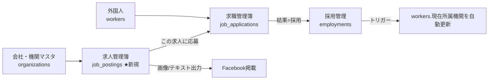

# 求人・求職・採用 管理設計書（Phase 4拡張）

最終更新: 2026-07-14

対象: 求人管理簿（厚生労働省の記載事項準拠）・Facebook掲載用出力・求職管理簿・採用管理を一連のフローとして実装する。旧データ移行（Phase 5）も本書の後段に含む。

## 1. 全体像



- **求人管理簿（新規）**: どの機関が・何の職種を・何人・いくらで募集しているかの台帳。厚労省「求人管理簿」の記載事項を網羅し、Facebook掲載用の表示項目を別枠で持つ
- **求職管理簿（0004で作成済みのテーブルを拡張）**: 「誰が・どの求人に・いつ応募し・結果どうなったか」。求人に紐づけて記録する（求人を介さない応募も従来どおり記録可）
- **採用管理（0004で作成済み）**: 結果「採用」になったら採用記録を作成。どの応募からの採用かを紐づけ、現在所属機関はDBトリガーで自動更新（実装済み）

## 2. 求人管理簿（job_postings）の項目

### 2.1 厚労省 求人管理簿の記載事項（台帳として保存）

| 厚労省の記載事項 | 列 | 備考 |
|---|---|---|
| 求人者の氏名又は名称 | organization_id → organizations.name | 機関マスタから選択 |
| 求人者の所在地 | organizations.address を参照 | マスタ側で管理 |
| 求人に係る連絡先 | contact | 担当者名・電話（未入力ならマスタの連絡先） |
| 求人受付年月日 | received_on | |
| 求人の有効期間（無効となった年月日） | valid_until / closed_on | 充足・取下げ時に closed_on を記録 |
| 求人数 | openings | 何人 |
| 求人に係る職種 | job_type | 例: 惣菜製造 |
| 就業場所 | work_location | |
| 雇用期間 | employment_period | 例: 期間の定めなし／1年更新 |
| 賃金 | wage_type（時給/月給）＋ wage_min / wage_max | 例: 時給1,100〜1,300円 |
| 取扱状況（紹介・採否・採用年月日） | job_applications / employments との紐づけで自動集計 | 別テーブル |

### 2.2 Facebook掲載用の項目（画像/テキスト出力に使用）

| 項目 | 列 | 例 |
|---|---|---|
| 掲載用に記載する会社名 | display_company | 「食品製造工場（福岡県）」など正式名と変えられる |
| 掲載用の簡易的な住所 | display_address | 「福岡県久留米市」 |
| 対象国籍 | target_nationality | 「ベトナム・ミャンマー」「不問」 |
| 募集人数 | openings（共通） | 2名 |
| 性別 | gender | 男性／女性／不問 |
| 給与 | wage_type + wage_min/max（共通） | 時給1,100円〜 |
| 採用予定時期 | hire_timing | 「2026年9月頃」 |
| 状態 | status | 募集中／充足／終了 |
| 備考 | note | シフト・寮の有無など自由記載 |

### 2.3 出力機能

- 求人詳細に **「Facebook掲載用に出力」** ボタン
  - **テキスト出力**: 定型文を生成して1タップコピー（LINE報告文と同じUI）
  - **画像出力**: 掲載カード（会社名・場所・職種・人数・性別・給与・採用時期）をその場で描画し、**PNG保存**ボタンでダウンロード（スマホは長押し保存も可）。html2canvas を使用（旧HTMLツールでも使っていたライブラリ）

## 3. 紐づけ（応募 → 採用）

- `job_applications`（0004作成済み）に **job_posting_id** 列を追加
  - 応募登録時に「どの求人への応募か」を選択（求人を介さない応募は空でも可）
- `employments`（0004作成済み）に **job_application_id** 列を追加
  - 応募結果を「採用」にすると採用記録ダイアログが開き、応募と紐づいた採用が登録される
  - 採用登録と同時に、実装済みのDBトリガーが workers の現在所属機関を自動更新
- これにより **求人詳細画面で「この求人に誰が応募し、誰が採用されたか」が一覧できる**（厚労省管理簿の取扱状況欄に相当）

## 4. 画面構成

| 画面 | 内容 |
|---|---|
| `/postings` 求人管理簿 一覧 | 状態（募集中/充足/終了）・機関でフィルター。カードに職種・人数・給与・応募数 |
| `/postings/new` 求人登録 | §2の項目を入力（機関はマスタから選択） |
| `/postings/[id]` 求人詳細 | 台帳情報・**応募者一覧（誰が応募したか・採否）**・Facebook出力・編集・充足/終了 |
| 外国人詳細に「求職」タブ | その人の応募履歴（求人選択・応募日・面接日・結果日・採用/不採用/辞退）を追加・編集 |
| `/jobs` 選考中の横断ビュー | 全員の選考中応募を一覧（面接日順）。結果の入力もここから可能 |
| ホーム管理メニュー | 「求人管理簿」「選考状況」へのリンクを追加 |

## 5. DB変更（migrations/0012）

```sql
create table job_postings (
  id, organization_id (FK・必須), 
  -- 台帳項目: received_on, valid_until, closed_on, openings, job_type,
  --           work_location, employment_period, wage_type, wage_min, wage_max, contact,
  -- 掲載項目: display_company, display_address, target_nationality, gender, hire_timing,
  status（募集中/充足/終了）, note, created_at, updated_at
);
alter table job_applications add column job_posting_id uuid references job_postings;
alter table employments     add column job_application_id uuid references job_applications;
-- RLS: 既存テーブルと同方針（閲覧=全ロール、書き込み=admin/staff）
```

## 6. 実装順序

1. **Phase 4a 求人管理簿**: 0012適用 → `/postings` 一覧・登録・詳細 → Facebook出力（テキスト→画像）
2. **Phase 4b 求職・採用**: 外国人詳細の求職タブ → 応募と求人の紐づけ → 採用ダイアログ（employments登録・所属自動更新）→ `/jobs` 横断ビュー → 求人詳細の応募者一覧
3. **Phase 5 旧データ移行**: `/workers/import` 画面で旧HTMLツールの「JSON保存」ファイルを取込（legacy_id でUPSERT・取込サマリー表示・通算値の検算）

## 7. 確定した方針（2026-07-14 ユーザー確認済み）

1. **給与の入力**: 時給/月給の区分＋**単一額**（wage_type + wage_amount）。幅（min〜max）は持たない
2. **Facebook画像のデザイン**: まずシンプルな1枚カード（白地・ネイビー見出し・項目箇条書き）。実物を見てから調整。実装は外部ライブラリを使わず Canvas API で直接描画（オフライン・CSP制約に強い）
3. **求人数の充足判定**: 採用数が求人数に達したら状態を「充足」に**自動更新**（手動変更も可）
